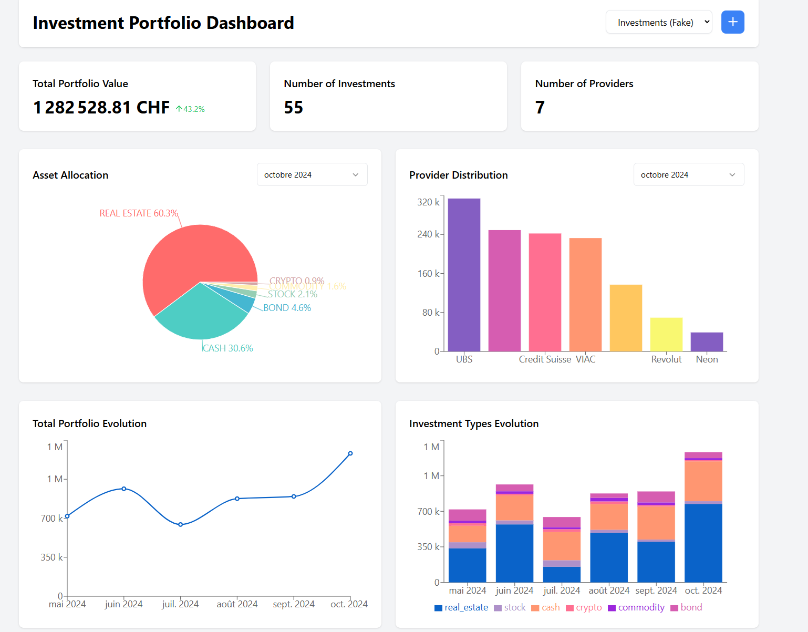
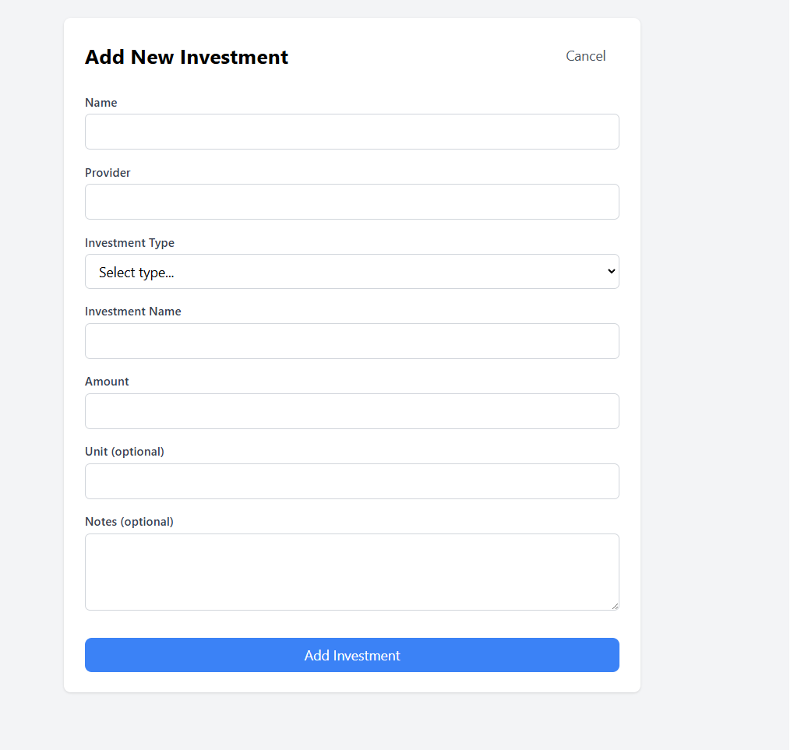
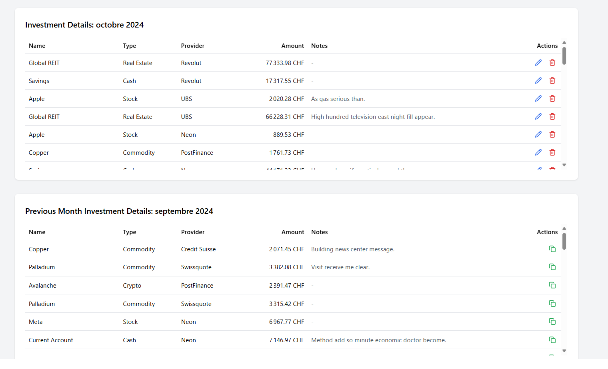

# Investment Portfolio Tracker



A full-stack application for tracking and managing investment portfolios with real-time visualization and analytics.

## Features

- 📊 Real-time portfolio visualization with interactive charts
- 💰 Track multiple investment types (stocks, bonds, crypto, etc.)
- 📈 Historical performance tracking
- 🏦 Multi-provider support
- 📱 Responsive dashboard interface
- 🔄 Real-time data updates
- 📝 Notes and annotations support

## Tech Stack

- **Frontend**: React.js, Vite, Tailwind CSS, Recharts
- **Backend**: Express.js, Node.js
- **Database**: PostgreSQL
- **Containerization**: Docker
- **Development Tools**: pgAdmin

## Prerequisites

- Docker Desktop (https://www.docker.com/products/docker-desktop/) 
- Git (https://git-scm.com/downloads)

## Installation

1. Clone the repository:
```bash
git clone https://github.com/DenizSungurtekin/Investment-Portfolio-Tracker
cd investment-portfolio-tracker
```

2. Create a `.env` file in the root directory with the following content:
```env
POSTGRES_USER=yourname
POSTGRES_PASSWORD=yourdbpassword
POSTGRES_DB=investments
PGADMIN_EMAIL=your.email@example.com
PGADMIN_PASSWORD=yourdbpassword
```

3. Start the application using Docker Compose:
```bash
docker-compose up --build
```

Go to http://localhost:5173/ And Enjoy !

### Dev commands
If you want to rerun clean (for dev purpose) It will refactor all your docker be careful. Adjust the prune command at will:
```bash
docker-compose down
docker system prune -a --volumes -f
docker-compose up --build
```
## Services

The application runs three main services:

- **Frontend + Backend**: Running on `http://localhost:5173`
- **PostgreSQL Database**: Running on `localhost:5432`
- **pgAdmin**: Available at `http://localhost:5050`

## Architecture

```
project/
├── src/
│   ├── backend/        # Express.js server
│   ├── components/     # React components
│   └── pages/         # React pages
├── public/            # Static assets
├── Dockerfile         # Container configuration
├── docker-compose.yml # Service orchestration
└── ingest_fake_data.py # Sample data generator
```

## Development

### Database Management

- Access pgAdmin at `http://localhost:5050`
- Login using credentials from `.env`
- Connect to database using:
  - Host: `postgres`
  - Port: `5432`
  - Username: from `.env`
  - Password: from `.env`

## API Endpoints

### Investments

- `GET /api/investments/:tableName` - Get all investments
- `POST /api/investments/:tableName` - Create new investment
- `PUT /api/investments/:tableName/:id` - Update investment
- `DELETE /api/investments/:tableName/:id` - Delete investment

## Configuration

### Analyse your own investments

Add records of your own investments with the add button or by copying samples from previous month and editing them.




Do not hesitate to make back up of your investments table !

(Potential Implementation of button which can do the backup automatically)
### Environment Variables

| Variable | Description | Default |
|----------|-------------|---------|
| POSTGRES_USER | Database username | - |
| POSTGRES_PASSWORD | Database password | - |
| POSTGRES_DB | Database name | investments |
| PGADMIN_EMAIL | pgAdmin login email | - |
| PGADMIN_PASSWORD | pgAdmin login password | - |

## Troubleshooting

1. **Database Connection Issues**
   - Ensure PostgreSQL container is running: `docker ps`
   - Check logs: `docker logs postgres_db`
   - Verify environment variables in `.env`

2. **Container Issues**
   - Rebuild containers: `docker-compose up --build`
   - Clean up: `docker-compose down -v`

## Contributing

1. Fork the repository
2. Create your feature branch: `git checkout -b feature/my-feature`
3. Commit your changes: `git commit -am 'Add new feature'`
4. Push to the branch: `git push origin feature/my-feature`
5. Submit a pull request

## License

This project is licensed under the MIT License - see the LICENSE file for details.

## Improvoment Idea

1. Tax and credit Manager
2. Add Investment advice with GPT
3. For different type of investment show increase or decrease of value monthly
